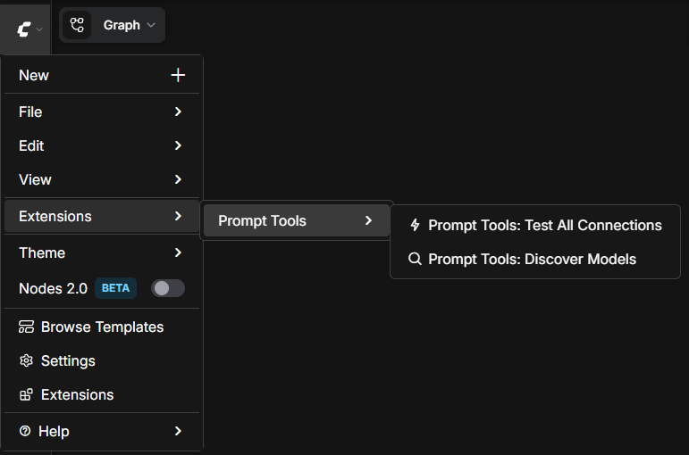
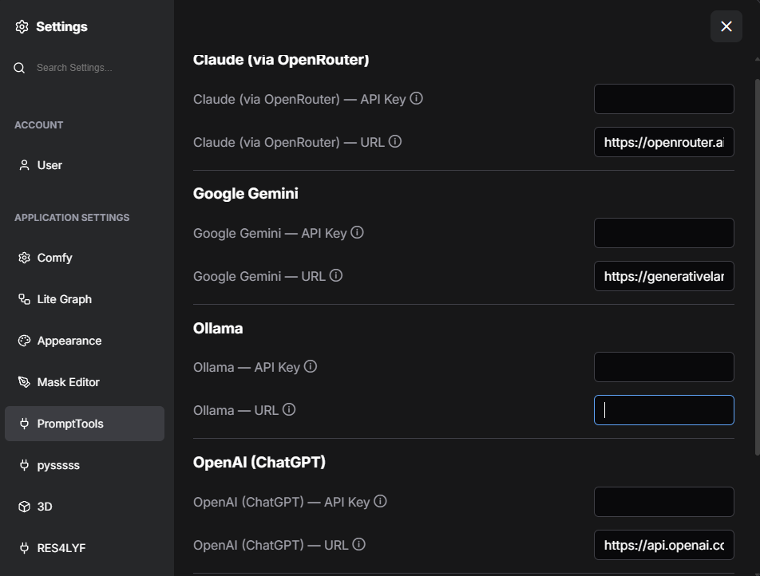
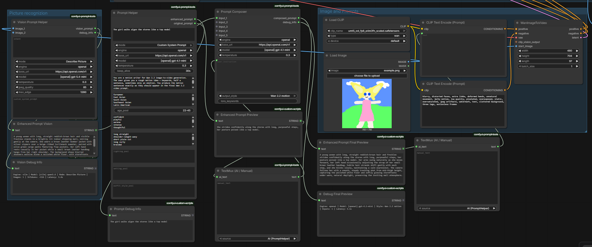

# comfyui-prompt-tools

LLM-powered prompt-engineering tools for ComfyUI. Four nodes that share a
common engine selector with five pluggable backends — Ollama, vLLM, OpenAI,
Claude (via OpenRouter) and Gemini:

- **PromptHelper** — Translates short user input into a fully-formed prompt
  for FLUX, FLUX Kontext, Qwen Image Edit, SDXL, Z-Image, or Pony/Illustrious.
- **VisionPromptHelper** — Extracts or edits prompts from one or two reference
  images via a vision LLM. 14 modes split into edit-modes (transform an image)
  and describe-modes (extract one aspect as a snippet).
- **PromptComposer** — Fuses 1–5 description snippets and a user instruction
  into one final prompt via LLM call. Output styles: FLUX.2 natural language,
  SDXL tag-based, Z-Image compact.
- **TextMux** — Switches a CLIPTextEncode input between an AI-enhanced source
  and a manual override.

## Status

Stable / v1.1. Install via [ComfyUI-Manager](https://github.com/ltdrdata/ComfyUI-Manager)
once the registry entry is published, or `git clone` directly into
`custom_nodes/` (see below).

See [`CHANGELOG.md`](CHANGELOG.md) for the release history.

### Supported LLM providers

| Provider | Status | Notes |
|---|---|---|
| **Ollama** | Stable | Local; no API key required. |
| **vLLM** | Stable | Local / self-hosted; OpenAI-compatible endpoint. |
| **OpenAI** | Stable | API key required. Bring your own. |
| **Google Gemini** | Stable | API key required. Uses the OpenAI-compatible endpoint. |
| **OpenRouter (Claude)** | **Experimental — untested by the author** | Code path is identical to the OpenAI one (OpenAI-compatible endpoint). Should work out of the box, but please report rough edges via [Issues](https://github.com/wernerberHH/comfyui-prompt-tools/issues). |

API keys can be entered via the **PromptTools Settings tab** in ComfyUI
(see screenshots below). Keys are written to a gitignored
`config/api_keys.yaml` with `0600` permissions and never leave the
ComfyUI host.

## Installation

Clone into your ComfyUI `custom_nodes/` directory and install the one
runtime dependency (`pyyaml`, optional but enables URL/model autocomplete):

```bash
cd /path/to/ComfyUI/custom_nodes
git clone git@github.com:wernerberHH/comfyui-prompt-tools.git
pip install pyyaml
```

Restart ComfyUI to load the nodes. If `pyyaml` is absent the nodes still work
— the engine URL / model fields just degrade to plain text inputs.

After restart, the package adds a **Prompt Tools** submenu under
`Extensions` with two utility commands — *Test All Connections* (pings
every configured provider once) and *Discover Models* (refreshes the
model dropdowns from each provider's live `/models` endpoint).



## Configuring providers

You have **two ways** to tell the nodes where your LLMs live and what API
keys to use:

1. **Settings UI** (recommended for API keys) — go to
   `Settings → PromptTools` in ComfyUI. Every supported provider has a
   URL field and an API-key field. Saved values land in a gitignored,
   `0600`-protected `config/api_keys.yaml` next to the package, so keys
   never end up in `endpoints.yaml` or anything that gets committed.

   

2. **`endpoints.yaml`** (recommended for URLs + the model dropdowns) —
   see below.

You can mix the two: typical setup is to put **URLs and model lists** in
`endpoints.yaml` (so the dropdowns are populated for autocomplete) and
**API keys** in the Settings UI (so they stay out of the YAML file).

## Quickstart: endpoints.yaml

The engine selector in every node (`engine` dropdown + `base_url` + `model`)
can auto-populate the URL and model dropdowns from a config file. To enable:

```bash
cd /path/to/ComfyUI/custom_nodes/comfyui-prompt-tools/config
cp endpoints.yaml.example endpoints.yaml
# edit endpoints.yaml — point it at your Ollama / vLLM servers and cloud endpoints
```

`endpoints.yaml` is gitignored, so your URLs and model names stay private.
The committed `.example` file is used as fallback when no user file is
present, so the nodes always work out of the box.

The `base_url` and `model` dropdowns show every URL and every model across
**all** engines in one combined list — ComfyUI's `INPUT_TYPES` can't filter
by the current `engine` selection. You're responsible for picking a URL and
model that match your chosen `engine`; a mismatch surfaces as a connection
error at run time.

Schema:

```yaml
engines:
  ollama:
    - url: "http://localhost:11434"
      models: ["qwen3-vl:8b", "llama3.2:3b"]
  vllm:
    - url: "http://localhost:8000/v1"
      models: ["Qwen/Qwen2.5-7B-Instruct"]
```

The committed `endpoints.yaml.example` also documents the network
topology choice (same-host vs separate-hosts deployment) in its
header, including the Docker-bridge gotcha for same-host container
deployments — if ComfyUI runs in a Docker container with default
bridge networking, it can't reach the host as `localhost`, and you
need either `network_mode: host` or `host.docker.internal`.

## Per-model system prompts

PromptHelper, VisionPromptHelper, and PromptComposer can use
model-family-specific variants of any system prompt. When you pick a
model whose name matches one of the known families (currently
`Fermi/Cydonia*`, `qwen3-vl*`, `qwen3*`, `gemma*`, `huihui_ai/*`,
`llama*`), the loader prefers `<mode>.<family>.txt` over the default
if such a file exists in `system_prompts/`. No override files ship
with the public release — drop your own `<mode>.<family>.txt` into
`system_prompts/` to activate the cascade. The fallback is silent —
modes without an override use the default, exactly as before. See
[`docs/system-prompt-overrides.md`](docs/system-prompt-overrides.md)
for the cascade and how to author your own override.

## Updating

```bash
cd /path/to/ComfyUI/custom_nodes/comfyui-prompt-tools
git pull
# restart your ComfyUI instance to reload the nodes
```

## Modes (PromptHelper)

| Mode | Output style | Use case |
|---|---|---|
| FLUX Kontext (Scene Edit) | Natural-language edit instructions | Single-image edits via FLUX Kontext |
| FLUX Kontext (Couple Scene) | Two-image multi-reference instructions | Add a second person to a scene |
| Qwen Image Edit (Couple Scene) | Three-image multi-reference instructions | Couple compositing with pose ref |
| FLUX Text-to-Image | Rich natural-language description | Standalone FLUX text-to-image |
| Z-Image Text-to-Image | Dense natural-language description | Standalone Z-Image Turbo text-to-image |
| SDXL Photorealistic | Comma-separated SDXL phrases | SDXL realistic-photo workflows |
| SDXL Pony/Illustrious | Booru-style tag list with score tags | Pony Diffusion / Illustrious XL |
| Random Character (Z-Image) | Long natural-language description | Bulk character ideation on Z-Image |
| Random Character (Pony) | Tag list with random variation slots | Bulk character ideation on Pony |
| Custom System Prompt | User-supplied | Anything else |

The two **Random Character** modes use configurable pools (ethnicity, age,
mood, hair, optional lighting / setting / outfit_style). Items in a pool are
separated by either commas or newlines. `IS_CHANGED` returns `NaN` for these
modes so each queue produces a fresh random pick instead of a cached result.

## Modes (VisionPromptHelper)

**Edit modes** — input one (or two for Outfit Transfer) reference images,
output an edit-instruction prompt:

| Mode | Use case |
|---|---|
| Outfit Transfer | Transfer outfit from image 2 onto person in image 1 |
| Hair Change | Change hairstyle while preserving identity |
| Body Reshape | Adjust body shape (with anatomy safety) |
| Background Change | Replace background |
| Pose Change | Change pose while preserving identity |
| Combined Edit | Multi-aspect edit in one prompt |

**Describe modes** — input one reference image, output a short snippet
about that aspect (ready to feed into PromptComposer):

| Mode | What it describes |
|---|---|
| Describe Face | Facial features only |
| Describe Hair | Hair color, length, style, texture |
| Describe Body | Body shape, build, proportions |
| Describe Pose | Body pose, gesture, gaze direction |
| Describe Outfit | Clothing, materials, cuts, colors |
| Describe Background | Environment, setting, mood |
| Describe Lighting | Light direction, hardness, color temp |
| Describe Composition | Framing, perspective, camera angle |

## Pipeline-of-specialists workflow

Ready-to-load demo workflows live in [`examples/`](examples/) — see
[`examples/README.md`](examples/README.md) for a description of each
one, the models they expect, and which LLM provider they default to.

Below: the Wan 2.2 image-to-video demo workflow (`examples/video_v1_wan22_i2v_demo.json`),
which exercises all four nodes — VisionPromptHelper for scene
description, PromptHelper for motion writing, PromptComposer for
fusion, and TextMux for an AI/manual override switch.



See [`docs/composer-workflow-guide.md`](docs/composer-workflow-guide.md) for a
worked write-up of how to chain describe-modes into PromptComposer for
multi-subject identity-stable scene generation.

### Where to wire each PromptHelper: `user_instruction` vs the five inputs

The `PromptComposer` has **one `user_instruction` field** (multiline text)
and **five generic input slots**. They are not interchangeable:

| Field | Role in the composer | Wire this when your helper produces… |
|-------|---------------------|--------------------------------------|
| `user_instruction` | **Dominant intent.** Decides scene framing, emphasis, mood (image styles) or motion + camera (Wan video style). Wins on conflict. | …the *overall scene idea* — what is being shown, the mood, the motion, the camera, the framing. |
| `input_1` … `input_5` | **Raw material.** Aspect snippets the composer fuses into the dominant intent; drops snippets that don't fit. | …a *single aspect* — face, hair, body, outfit, background, lighting, composition, etc. |

**Rule of thumb**

- If the helper answers *"what is shown?"* → wire it into `user_instruction`.
- If the helper answers *"what does one aspect of it look like?"* → wire it
  into one of the five inputs.

**For image composers** (`Z-Image`, `FLUX.2`, `SDXL` styles): `user_instruction`
holds the scene, subject framing and mood; the inputs hold per-aspect detail.

**For the Wan 2.2 video composer**: `user_instruction` holds the motion and
camera intent; the inputs hold subject and atmosphere. Image-description
snippets in the inputs are explicitly *not* treated as motion sources — putting
movement into an input slot will weaken it. If your Wan output looks static,
that's the first thing to check.

If you only have one helper that produces a complete scene description, route
it into `user_instruction` and leave the input slots empty. If you have several
aspect-specific helpers (the classic "pipeline of specialists" pattern),
each goes into an input slot and you write the `user_instruction` text
yourself as the connective tissue.

## Testing

```bash
pip install -e ".[test]"
python -m pytest tests/unit/ -v
```

The suite is hermetic — no network, no real model calls. Engine HTTP layers
are patched via fixtures in `tests/conftest.py`.

## Repository layout

```
comfyui-prompt-tools/
├── __init__.py                       ComfyUI loader entry point
├── comfyui_prompt_tools/
│   ├── __init__.py                   package
│   ├── prompts.py                    system-prompt loader
│   ├── vision_prompts.py             vision-mode loader
│   ├── config_loader.py              endpoints.yaml reader
│   ├── post_processing.py            output cleanup
│   ├── random_pools.py               pool-pick helpers
│   ├── image_io.py                   tensor → base64 helper
│   ├── engines/
│   │   ├── ollama_client.py          /api/chat client
│   │   └── openai_client.py          /v1/chat/completions client (vLLM)
│   ├── nodes/
│   │   ├── base_prompt_node.py       shared engine selector
│   │   ├── prompt_helper.py
│   │   ├── vision_prompt_helper.py
│   │   ├── prompt_composer.py
│   │   └── text_mux.py
│   └── system_prompts/
│       ├── _shared_rules.txt.example
│       └── <mode>.txt.example        one template per mode (committed)
│                                      copy to <mode>.txt to customise locally
├── config/
│   └── endpoints.yaml.example        URL / model autocomplete config
├── docs/                             pipeline patterns, mode-adding guide,
│                                      system-prompt override docs
└── tests/unit/                       hermetic unit tests
```

## License

MIT — see [LICENSE](LICENSE).
