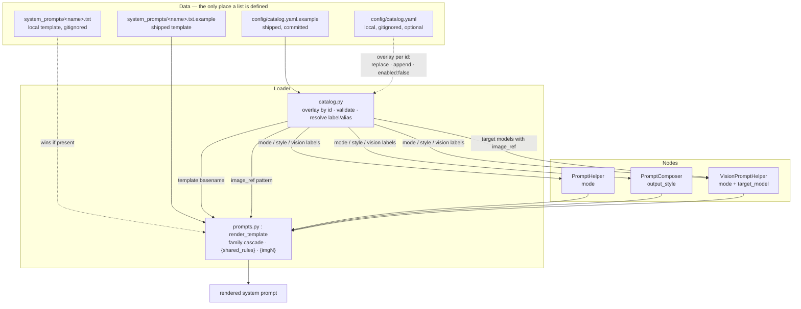
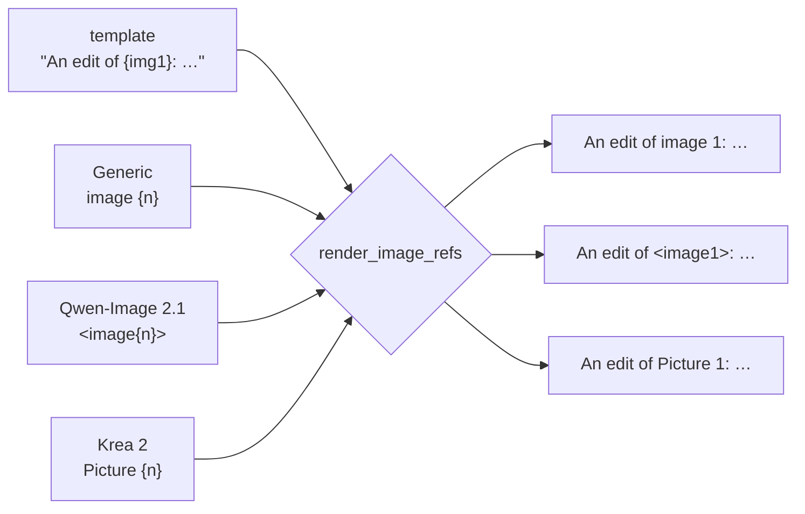

# Architecture — the prompt catalog

## What it replaces

Until v1.1.x every selectable value lived in Python: `MODE_TO_FILE` in
`prompts.py`, `OUTPUT_STYLES` / `_STYLE_TO_FILE` in
`nodes/prompt_composer.py`, `VISION_MODE_TO_FILE` and `TWO_IMAGE_MODES`
in `vision_prompts.py`. Adding a mode meant editing two or three source
files, and 17 templates hard-coded `image 1` / `IMAGE 1`.

That second part was the actual bug. Target models do not agree on how a
prompt addresses its reference images:

| Target model | How the prompt names image 1 |
|---|---|
| FLUX Kontext, FLUX.2 multi-reference | `image 1` |
| Qwen-Image-Edit 2511, Krea 2 | `Picture 1` |
| Qwen-Image 2.1 | `<image1>` |

A template that writes `image 1` therefore produces a working prompt for
one model and a broken one for the next — Qwen-Image 2.1 read
`image 1 features …` as a description of the *person*, not as a routing
token.

The catalog moves both concerns into data: **one file holds every list,
and the image-reference wording is a property of the target model.**

## The pieces

`config/catalog.yaml.example` is the complete shipped truth. An optional
`config/catalog.yaml` is overlaid on it, matched by `id` — same id
replaces the listed fields, a new id is appended, `enabled: false` hides
an entry. This is the same "ship the `.example`, let the user file win"
pattern already used for `endpoints.yaml`, `api_keys.yaml`,
`model_families.yaml` and the templates themselves.

### Sections

| Section | Feeds | Extra fields |
|---|---|---|
| `target_models` | the VisionPromptHelper `target_model` dropdown (only entries with `image_ref`) | `image_ref` |
| `prompt_helper_modes` | the PromptHelper `mode` dropdown | `template`, `target_model`, `uses_random_pools` |
| `composer_styles` | the PromptComposer `output_style` dropdown | `template`, `target_model` |
| `vision_modes` | the VisionPromptHelper `mode` dropdown | `template`, `kind`, `images` |

Every entry has `id`, `label`, optional `aliases` and optional
`enabled`.

## Rendering a system prompt

`prompts.render_template(basename, model_name, target_model)` is the one
place all three nodes go through. Three substitutions, in order:

1. **Per-LLM-family cascade** — `<basename>.<family>.txt` wins over
   `<basename>.txt`, which wins over `<basename>.txt.example`. Unchanged
   by the catalog; see
   [`../system-prompt-overrides.md`](../system-prompt-overrides.md).
2. **`{shared_rules}`** → the contents of `_shared_rules.txt`.
3. **`{img1}` / `{img2}` / `{img3}`** → the `image_ref` pattern of the
   target model, with `{n}` replaced by the number.

Step 3 uses plain string substitution, not `str.format`, so a template
may contain any other braces without escaping them.

### Which node passes what

- **VisionPromptHelper** passes the `target_model` the user picked. This
  is the only node with that input, because it is the only one whose
  output is an instruction *about specific input images*.
- **PromptHelper** and **PromptComposer** always render with `Generic`,
  so their output is byte-identical to v1.1.x. Their catalog entries
  still carry a `target_model` field: it documents which model the mode
  writes for and is what a future per-node selector will read.

## Two kinds of image reference

The distinction matters more than it looks:

| Purpose | Audience | Notation | Depends on `target_model`? |
|---|---|---|---|
| "which input image is which" | the **vision LLM** reading the images | fixed prose: "the first image", "the second image" | no |
| "name the image in the prompt you produce" | the **image model** downstream | `{img1}`, `{img2}` | yes |

Keeping the two lexically distinct is deliberate: when the internal
instruction said `image 1` *and* the output token was supposed to be
`<image1>`, the LLM copied the internal wording into its output.

Describe modes have no second column at all — their output is a snippet
that a composer pastes into a larger prompt, where any image reference
would point at the wrong picture. Their templates therefore carry
neither a literal reference nor a placeholder, and a parametrised test
in `tests/unit/test_catalog.py` asserts that.

**Image order is a contract.** `image_1` on the node renders as
`{img1}`, so the images must be wired to the VisionPromptHelper in the
same order they are wired to the image model.

## Aliases and saved workflows

A ComfyUI workflow stores a combo value as a plain string. Renaming a
label would therefore break every saved workflow using it — which is why
labels are frozen once released and renames go through `aliases`.

ComfyUI validates combo values *before* any node code runs and rejects
anything not in the current list ("Value not in list"). The escape hatch
is a `VALIDATE_INPUTS` classmethod: naming an input as one of its
parameters makes ComfyUI skip its own list check for that input and call
the classmethod instead. All three nodes use it:

| Node | Validated inputs |
|---|---|
| PromptHelper | `mode` |
| PromptComposer | `output_style` |
| VisionPromptHelper | `mode`, `target_model` |

Each resolves the value through the catalog (label **or** alias) and
returns a message listing the known values when it cannot. None of them
declares `**kwargs`, which would switch off the built-in `min`/`max`
checks for every other input as well.

ComfyUI attaches one non-`True` return to *every* input in the signature
(`for x in input_filtered` over a single result), so a return value
cannot say "this input is fine, that one is not". Every message therefore
names its own input — otherwise a bad `target_model` reads as
`mode - Unknown target model: ''`. The shared helper lives in
`nodes/catalog_validation.py`.

### The frontend half

Server-side acceptance is only half the job. The frontend restores a
widget from the saved value, and a value missing from the combo list
shows as invalid and would be written back on the next save. So the
extension in `web/` fetches `GET /comfyui-prompt-tools/catalog-aliases`
— the catalog's former-to-current label map, which `/object_info` cannot
provide because it carries only the current list — and rewrites stale
values in its `loadedGraphNode` hook. Only strings that are known former
labels are touched; anything else is left for the node's own validation
to report. If the fetch fails, migration is skipped and the workflow
still runs on the server-side aliases.

## Widget order is part of the contract

A saved workflow stores no widget names. Each node is a flat
`widgets_values` array, mapped onto the node's widgets **by position** on
load. Consequences:

- **A new input is appended, never inserted.** `target_model` initially
  sat before `custom_system_prompt` on VisionPromptHelper; existing nodes
  store nine values ending in the custom prompt, so that prompt was
  handed to `target_model` — validation failed with
  `Unknown target model: ''`, or the whole system prompt travelled as a
  target-model name while `custom_system_prompt` came up empty.
- **Unset must mean default.** Both `None` (input absent) and `""`
  (what a shift or a hand-edited workflow delivers) resolve to `Generic`.
- `forceInput` inputs and link-only types (`IMAGE`, …) are sockets and
  occupy no slot; a widget the user converted to an input keeps its slot.

`tests/unit/test_widget_positions.py` reconstructs the positional mapping
from `INPUT_TYPES` and asserts the pre-v1.2.0 order is still an exact
prefix of the current one. API-level tests cannot catch this class of bug
— an API prompt is a dict keyed by input name.

## Failure behaviour

`config_loader` degrades silently — a missing `endpoints.yaml` just
means no autocomplete. The catalog does the opposite and raises
`CatalogError` on load, because without it the nodes have no dropdown
values at all and would register empty. Validated on every load:

- `version` present and supported
- all four sections present and lists of mappings
- unique `id` per section, after the overlay
- unique labels **and** aliases per list (an alias resolves like a
  label, so a collision is ambiguous rather than last-one-wins)
- every `template` resolves to a file on disk
- every `target_model` reference is a known `target_models` id
- every `image_ref` contains `{n}`
- `kind` is `edit` or `describe`; `images` is 1 or 2
- a `generic` target model exists and has an `image_ref`

Messages name the section, the entry id and the field.

## Files

| Path | Role |
|---|---|
| `config/catalog.yaml.example` | the catalog, shipped and commented |
| `config/catalog.yaml` | optional local overlay, gitignored |
| `comfyui_prompt_tools/catalog.py` | load, overlay, validate, resolve, render `{imgN}` |
| `comfyui_prompt_tools/prompts.py` | template cascade + the three substitutions |
| `comfyui_prompt_tools/vision_prompts.py` | vision-mode view on the catalog |
| `comfyui_prompt_tools/nodes/*.py` | dropdowns and `VALIDATE_INPUTS` |
| `comfyui_prompt_tools/nodes/catalog_validation.py` | shared `VALIDATE_INPUTS` message builder |
| `comfyui_prompt_tools/web_api.py` | `/catalog-aliases` route for the frontend migration |
| `web/comfyui-prompt-tools.js` | rewrites stale labels as nodes are loaded |
| `tests/unit/test_catalog.py` | validation, overlay, aliases, `{imgN}`, describe-mode check |
| `tests/unit/test_widget_positions.py` | the positional `widgets_values` mapping |
